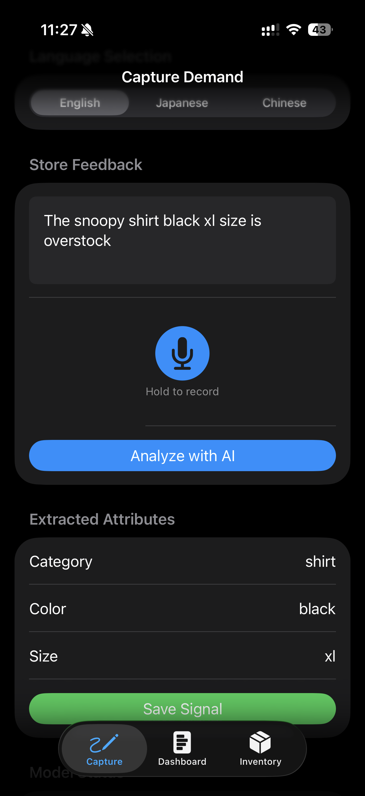
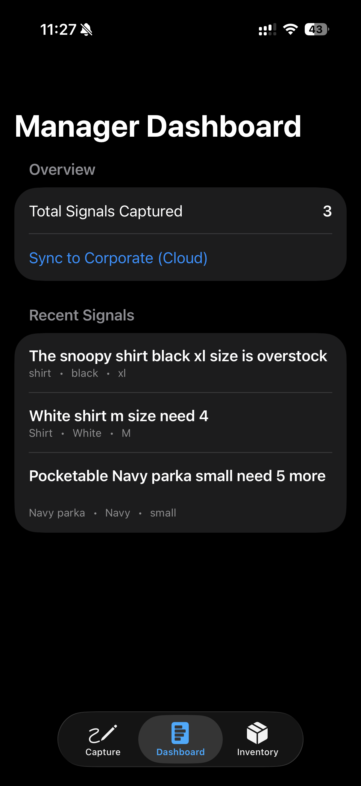
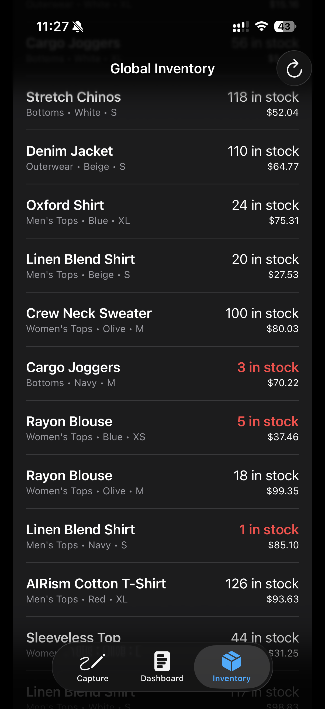
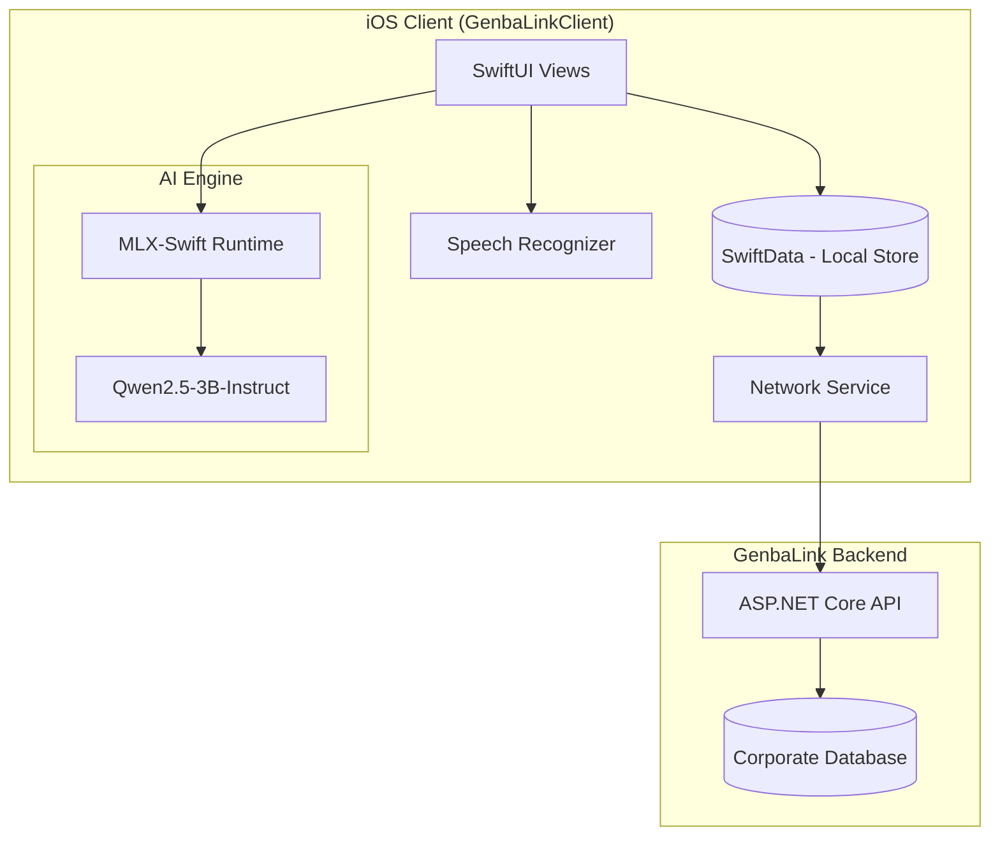

# GenbaLink iOS Client

**GenbaLink** is a next-generation "Invisible Demand" capture tool designed for retail environments. It empowers floor staff to capture customer requests and feedback in real-time using on-device AI, bridging the gap between front-line interactions and corporate inventory management.

---

## 📱 App Overview

| **Capture Demand** | **Manager Dashboard** | **Global Inventory** |
| :---: | :---: | :---: |
|  |  |  |
| *Voice & AI powered capture* | *Batch sync & analytics* | *Real-time stock monitoring* |

---

## 🚀 Key Features

### 1. Intelligent Demand Capture
- **Hands-Free Efficiency**: Capture customer requests instantly via voice, eliminating the need for slow manual typing during busy retail shifts. This ensures high-velocity data entry without interrupting the customer experience.
- **Multilingual Speech-to-Text**: Record customer feedback in English, Japanese, or Chinese using the integrated Apple Speech framework.
- **On-Device LLM Analysis**: Leverages **MLX AI (Qwen2.5-3B-Instruct)** to extract structured data (Category, Color, Size) from raw conversational input.
- **Privacy-First Architecture**: User privacy is paramount. Both speech recognition and LLM inference are performed **locally on the device**. No audio or raw text is sent to external servers for analysis, ensuring customer interactions remain private.
- **Offline First**: All captured signals are stored locally using **SwiftData** until they are ready to be synced.

### 2. Managerial Oversight
- **Real-time Dashboard**: Review all captured "Invisible Demand" signals before syncing.
- **Scalable Cloud Sync**: Batch-upload signals directly to the **GenbaLink Cloud Backend** for global trend analysis.
- **Connectivity Note**: While designed for cloud-first operations, developers or stores can run a backend instance on a **local machine (localhost)** within the same network to achieve near-instantaneous sync speeds and reduced latency.

### 3. Inventory Management
- **Global Stock Visibility**: Fetch and display real-time stock levels from the corporate API.
- **Manual Adjustments**: Quick-action stock updates directly from the floor.

---

## 🏗 System Architecture



---

## 🛠 Technology Stack

- **UI Framework**: SwiftUI
- **Persistence**: SwiftData
- **AI/ML**: [MLX Swift](https://github.com/ml-explore/mlx-swift) & [MLX Swift LM](https://github.com/ml-explore/mlx-swift-lm)
- **Networking**: URLSession (Async/Await)
- **Speech**: Apple Speech Framework (SFSpeechRecognizer)

---

## 📋 Prerequisites

- **Xcode 15.0+**
- **iOS 17.0+**
- **Hardware**: Apple Silicon (A-series or M-series chip) is highly recommended for optimal on-device LLM performance.

---

## ⚙️ Setup & Installation

1.  **Clone the Repository**:
    ```bash
    git clone https://github.com/your-repo/GenbaLink.git
    cd GenbaLink/GenbaLink-iOS/GenbaLinkClient
    ```

2.  **Open Project**:
    Open `GenbaLinkClient.xcodeproj` in Xcode.

3.  **Resolve Dependencies**:
    Xcode will automatically fetch the required Swift Packages (`mlx-swift` and `mlx-swift-lm`).

4.  **Configure API**:
    Update the `API_BASE_URL` in `GenbaLinkClient/Info.plist` to point to your GenbaLink Backend instance.

5.  **Build & Run**:
    Select your physical device or simulator and press `Cmd + R`.

---

## 📖 Usage

1.  **Capture**: Navigate to the "Capture" tab. Hold the microphone button to record customer feedback. Tap "Analyze with AI" to let the local LLM extract SKU attributes.
2.  **Review**: Go to the "Dashboard" tab to see all pending signals.
3.  **Sync**: Tap "Sync to Corporate" to upload the data.
4.  **Inventory**: Use the "Inventory" tab to check and adjust global stock levels.

---

*Developed for the GenbaLink ecosystem - Empowering the retail floor.*
