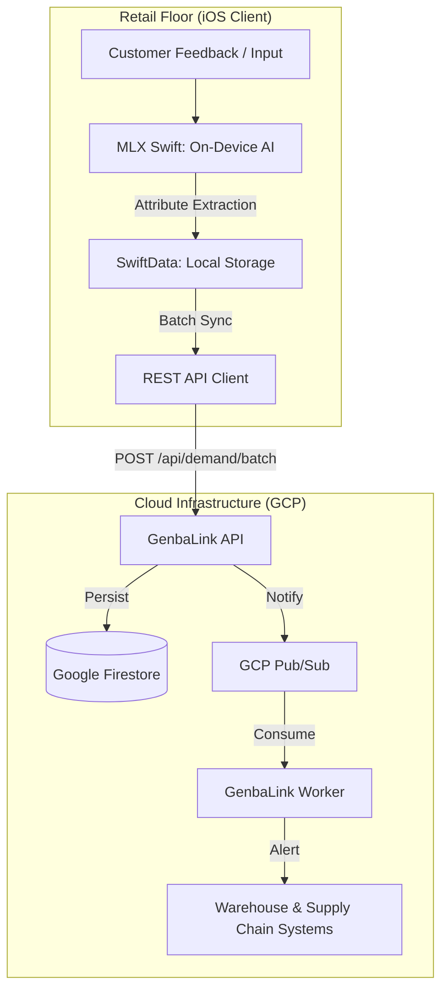
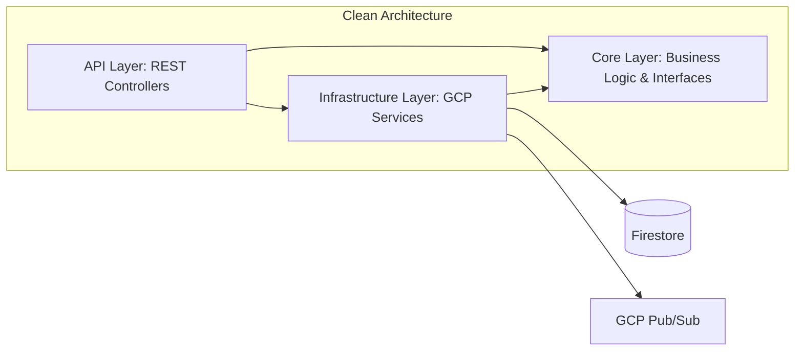

# GenbaLink: "Invisible Demand" Intelligence System

GenbaLink is a "Genba-First" intelligence platform designed to capture and aggregate unsatisfied customer demand directly from the retail floor. By leveraging on-device LLMs and a high-performance cloud backend, GenbaLink transforms verbalized "invisible demand" into actionable supply chain insights.

## System Architecture

### End-to-End Data Flow



### Backend Clean Architecture

The backend is built following Clean Architecture principles to ensure maintainability and testability:



---

## Key Features

- **Genba-First AI**: Utilizes **MLX Swift** to run `Qwen2.5-3B-Instruct` locally on iOS devices. This allows for real-time, offline-capable extraction of product attributes (Category, Color, Size) from raw customer requests.
- **Offline-First Persistence**: Captured signals are buffered in **SwiftData** and synced in batches to minimize network overhead and ensure reliability in environments with spotty connectivity.
- **High-Performance Aggregation**: A .NET 9 API aggregates signals in **Google Firestore**, detecting high-demand patterns across different stores.
- **Event-Driven Intelligence**: Significant demand shifts or low-stock scenarios trigger **GCP Pub/Sub** events, which are processed by a dedicated worker for automated warehouse alerts.

---

## Tech Stack

### Frontend (iOS)
- **UI Framework**: SwiftUI
- **AI Engine**: MLX Swift (Local LLM Execution)
- **Local Database**: SwiftData
- **Network**: URLSession with Batch Processing

### Backend (.NET 9)
- **Framework**: ASP.NET Core Web API
- **Primary Database**: Google Cloud Firestore (NoSQL)
- **Messaging**: Google Cloud Pub/Sub
- **Worker**: .NET 9 Hosted Services
- **Deployment**: Dockerized, optimized for Google Cloud Run

---

## Getting Started

### Prerequisites
- **iOS**: Xcode 16+, iOS 18+ (for SwiftData & MLX Swift)
- **Backend**: .NET 9 SDK, Docker (optional)
- **Cloud**: A GCP Project with Firestore and Pub/Sub enabled.

### 1. Backend Setup
Configure your GCP Project ID in `GenbaLink-Backend/GenbaLink.Api/appsettings.json`.

```bash
cd GenbaLink-Backend/GenbaLink.Api
dotnet run
```
The API will start at `http://localhost:8080` (or the port defined in your environment).

### 2. iOS App Setup
1. Open `GenbaLink-iOS/GenbaLinkClient/GenbaLinkClient.xcodeproj` in Xcode.
2. The project uses **MLX Swift**. Ensure the package is resolved.
3. Update the `API_BASE_URL` in `Info.plist` or `NetworkService.swift` to point to your local or deployed backend.
4. Run on a physical device for the best MLX performance (Requires Apple Silicon).

### 3. Running the Worker
```bash
cd GenbaLink-Backend/GenbaLink.Worker
dotnet run
```

---

## API Overview

- `GET /api/inventory`: Retrieve current stock levels.
- `POST /api/inventory/adjust`: Manually adjust stock (triggers low-stock alerts).
- `POST /api/demand/batch`: Sync a batch of demand signals from the retail floor.

---

## License
[MIT License](LICENSE)
