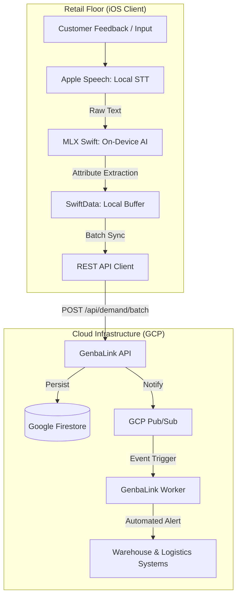

# GenbaLink: "Invisible Demand" Intelligence System
### Bridging the Gap Between the Retail Floor and Supply Chain Logistics

**GenbaLink** is a "Genba-First" (from the Japanese word *Genba*, meaning "the actual place") intelligence platform. It is designed to capture, structure, and aggregate **unsatisfied customer demand** directly from the retail floor, transforming verbalized "invisible demand" into real-time, actionable supply chain insights.

---

## 💎 The Business Value: Capturing Lost Sales

In traditional retail, demand is measured by *what was sold*. But what about **what was asked for but not in stock?** This is "Invisible Demand."

- **Identify Stock Gaps**: Detect real-time demand for out-of-stock items before they impact next week's inventory report.
- **Zero-Latency Intelligence**: Empower floor staff to capture customer feedback via voice in seconds—no manual forms or data entry.
- **Privacy-First AI**: All AI processing (Speech-to-Text and Attribute Extraction) happens **on-device**. No customer voices or raw transcripts ever leave the shop floor, ensuring absolute privacy and GDPR/CCPA compliance.
- **Cost Efficiency**: By running LLMs (`Qwen2.5-3B`) locally on iOS hardware, GenbaLink eliminates expensive per-token cloud AI costs while maintaining high-speed performance.

---

## 📱 Experience the "Genba" Interface

| **Voice Capture & AI Extraction** | **Store Manager Dashboard** | **Real-Time Global Inventory** |
| :---: | :---: | :---: |
|  |  |  |
| *Local AI extracts Category/Color/Size* | *Batch-sync signals to Cloud* | *Monitor & adjust stock levels* |

---

## 🏗 System Architecture

GenbaLink is built on a modern, decoupled architecture designed for global scale and zero-maintenance overhead.

### End-to-End Data Flow

### Technical Innovation Highlights

- **Edge AI (MLX Swift)**: Utilizes Apple Silicon's Neural Engine to run `Qwen2.5-3B-Instruct` locally. This allows for intelligent SKU extraction even in stores with spotty Wi-Fi.
- **Event-Driven Backend (.NET 9)**: A high-performance ASP.NET Core API coupled with a decoupled Worker service.
- **Serverless Scaling**: Leveraging **Google Cloud Run**, **Firestore**, and **Pub/Sub** for a system that scales to thousands of stores with zero server management.

---

## 🛠 Tech Stack

| **Component** | **Technologies** |
| :--- | :--- |
| **Frontend (iOS)** | SwiftUI, SwiftData, MLX Swift, Apple Speech Framework |
| **API Layer** | .NET 9 (C#), ASP.NET Core, Clean Architecture |
| **Database** | Google Cloud Firestore (NoSQL) |
| **Messaging** | Google Cloud Pub/Sub |
| **Worker Service** | .NET 9 Hosted Services |
| **DevOps** | Docker, Google Cloud Run, GitHub Actions |

---

## 📂 Project Structure

- **`GenbaLink-iOS/`**: The SwiftUI mobile application.
- **`GenbaLink-Backend/GenbaLink.Api/`**: RESTful entry point for demand aggregation and inventory management.
- **`GenbaLink-Backend/GenbaLink.Worker/`**: Background service for real-time event processing and fulfillment alerts.
- **`GenbaLink-Backend/GenbaLink.Core/`**: Domain logic and interface definitions (Clean Architecture).
- **`GenbaLink-Backend/GenbaLink.Infrastructure/`**: Implementation of GCP service integrations.

---

## 🚀 Getting Started

Detailed setup instructions for each component can be found in their respective directories:

- [**Backend Setup Guide**](GenbaLink-Backend/README_backend.md): Configure GCP and run the .NET services.
- [**iOS Client Guide**](GenbaLink-iOS/README_client.md): Build the app and deploy the local LLM.

